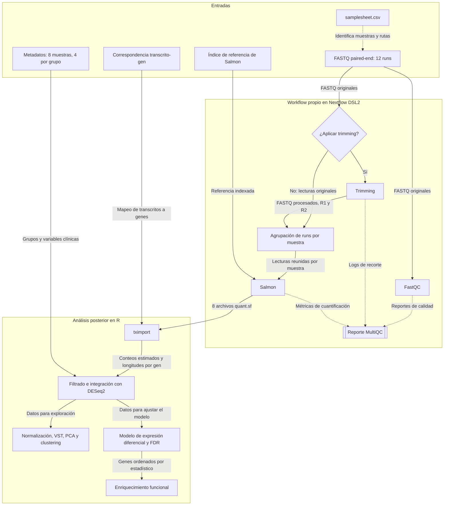

# Proyecto 1. Tabaquismo y expresión génica en carcinoma oral de células escamosas

**Entrega 1 - Diseño del proyecto**  
**Estudiante:** Javiera Canelo
**Fecha de entrega:** 12 de septiembre

## 1. Pregunta y objetivo

¿Qué diferencias de expresión génica y vías biológicas se asocian al tabaquismo reportado en tejido tumoral de pacientes con carcinoma oral de células escamosas HPV-negativo?

El objetivo es explorar estas asociaciones mediante un workflow de RNA-seq y un análisis posterior en R. Se compararán tumores de pacientes con tabaquismo reportado como “yes” frente a “no”. Los resultados se interpretarán como asociaciones, sin atribuir causalidad ni establecer biomarcadores clínicos validados.

## Justificación y relevancia biomédica

El tabaquismo es el principal factor de riesgo para el carcinoma oral de células escamosas (COCE), aunque se presenta tanto en personas fumadoras como no fumadoras. Comparar sus perfiles de expresión génica permite explorar si el tabaquismo reportado se asocia con diferencias en los procesos biológicos del tumor. Esto podría ayudar a formular hipótesis sobre mecanismos relacionados con proliferación, respuesta al daño celular o interacción con el microambiente tumoral.

Se seleccionan únicamente tumores HPV-negativos para mantener constante el estado viral y reducir una posible fuente de heterogeneidad biológica. La comparación se restringe, además, a la cavidad oral, distinguiéndola de la orofaringe, donde el papel del HPV es especialmente relevante.

Una motivación clínica es comprender si las diferencias moleculares podrían relacionarse con distintos comportamientos tumorales. Sin embargo, este proyecto no evaluará directamente agresividad, pronóstico ni respuesta al tratamiento. Los resultados permitirán generar hipótesis que requerirían validación con información clínica y cohortes mayores.

Dado el tamaño de cuatro pacientes por grupo y las diferencias de edad y sexo, el análisis tendrá carácter exploratorio y no permitirá atribuir causalidad al tabaquismo.

## 2. Dataset y diseño del estudio

Se utilizará **GSE184616**, disponible en GEO. Las lecturas originales están depositadas en SRA.

| Característica | Descripción |
|---|---|
| Organismo | Homo sapiens |
| Enfermedad | Carcinoma oral de células escamosas HPV-negativo |
| Dataset completo | 15 pacientes; 15 tumores y 15 tejidos normales adyacentes |
| Datos | Bulk RNA-seq de RNA total con eliminación de RNA ribosomal |
| Secuenciación | Illumina NovaSeq 6000, paired-end y específica de hebra |
| Selección | Ocho tumores primarios de ocho pacientes independientes |
| Comparación | Cuatro pacientes con smoking = yes y cuatro con smoking = no |
| Archivos previstos | 12 runs de SRA; 24 archivos FASTQ, correspondientes a R1 y R2 |
| BioProject | PRJNA765370 |
| Estudio SRA | SRP338257 |

Se excluyen los tejidos normales. Las mismas ocho muestras se utilizarán para el procesamiento y el análisis exploratorio de expresión diferencial.

## 3. Muestras seleccionadas y justificación

| Muestra | GEO | Smoking original | Edad | Sexo | Sitio anatómico | Runs |
|---|---|---|---:|---|---|---:|
| OSCC_4-P | GSM5593754 | Yes | 48 | Masculino | Piso de boca | 1 |
| OSCC_5-P | GSM5593756 | Yes | 22 | Masculino | Lengua | 1 |
| OSCC_13-P | GSM5593772 | Yes | 37 | Masculino | Lengua | 3 |
| OSCC_16-P | GSM5593776 | Yes | 42 | Masculino | Lengua | 1 |
| OSCC_1-P | GSM5593748 | No | 50 | Masculino | Lengua | 1 |
| OSCC_2-P | GSM5593750 | No | 33 | Masculino | Lengua | 1 |
| OSCC_10-P | GSM5593766 | No | 46 | Masculino | Lengua | 1 |
| OSCC_11-P | GSM5593768 | No | 50 | Femenino | Piso de boca | 3 |

Cada grupo incluye tres tumores de lengua y uno de piso de boca. Se mantiene así la misma distribución de estos sitios anatómicos. Las edades medias son 37,3 años en el grupo Yes y 44,8 años en el grupo No.

Se intentó equilibirar los grupos según sexo. Todos los pacientes con smoking = Yes de la tabla revisada son hombres. Solo hay tres hombres con smoking = No; por ello, la selección incluye una mujer en ese grupo. 

## 4. Workflow previsto

Se desarrollará un workflow propio en **Nextflow DSL2**, usando nf-core/rnaseq como referencia de organización y buenas prácticas. No se ejecutará el pipeline completo de nf-core.



### Decisiones de implementación

- **FastQC:** permitirá revisar la calidad de las lecturas originales. El trimming será una opción configurada tras revisar los reportes.
- **Trimming:** si se aplica, se documentarán la herramienta y los parámetros y se revisará la calidad posterior al recorte.
- **Agrupación:** los runs de OSCC_13-P y OSCC_11-P se reunirán por muestra, manteniendo correctamente asociados R1 y R2. Cada muestra producirá una sola cuantificación.
- **Salmon:** se utilizará para cuantificar transcritos. El índice y la correspondencia transcrito-gen procederán de una referencia y anotación compatibles.
- **MultiQC:** integrará los reportes y métricas compatibles de las herramientas. Constituye una rama de resumen de calidad, no una transformación de la matriz de expresión.
- **Reproducibilidad:** se fijarán versiones, referencias, parámetros y ambientes. Nextflow generará `report`, `timeline`, `trace` y `DAG`.


<div style="page-break-before: always;"></div>

## 5. Samplesheet

El archivo `metadata/samplesheet.csv` contiene una fila por run. La repetición de `sample` identifica runs de la misma muestra, no pacientes adicionales. Las rutas son planificadas y relativas a la raíz del repositorio, los FASTQ aaún no están descargados.

```csv
sample,run,fastq_1,fastq_2
OSCC_4-P,SRR16013054,data/raw/SRR16013054_1.fastq.gz,data/raw/SRR16013054_2.fastq.gz
OSCC_5-P,SRR16013056,data/raw/SRR16013056_1.fastq.gz,data/raw/SRR16013056_2.fastq.gz
OSCC_13-P,SRR16013082,data/raw/SRR16013082_1.fastq.gz,data/raw/SRR16013082_2.fastq.gz
OSCC_13-P,SRR16013083,data/raw/SRR16013083_1.fastq.gz,data/raw/SRR16013083_2.fastq.gz
OSCC_13-P,SRR16013084,data/raw/SRR16013084_1.fastq.gz,data/raw/SRR16013084_2.fastq.gz
OSCC_16-P,SRR16013090,data/raw/SRR16013090_1.fastq.gz,data/raw/SRR16013090_2.fastq.gz
OSCC_1-P,SRR16013048,data/raw/SRR16013048_1.fastq.gz,data/raw/SRR16013048_2.fastq.gz
OSCC_2-P,SRR16013050,data/raw/SRR16013050_1.fastq.gz,data/raw/SRR16013050_2.fastq.gz
OSCC_10-P,SRR16013070,data/raw/SRR16013070_1.fastq.gz,data/raw/SRR16013070_2.fastq.gz
OSCC_11-P,SRR16013072,data/raw/SRR16013072_1.fastq.gz,data/raw/SRR16013072_2.fastq.gz
OSCC_11-P,SRR16013073,data/raw/SRR16013073_1.fastq.gz,data/raw/SRR16013073_2.fastq.gz
OSCC_11-P,SRR16013074,data/raw/SRR16013074_1.fastq.gz,data/raw/SRR16013074_2.fastq.gz
```

<div style="page-break-before: always;"></div>

## 6. Análisis posterior y resultados esperados

1. Importar las cuantificaciones con `tximport` y agregar la información de transcritos a genes utilizando una correspondencia compatible con la referencia de Salmon.
2. Integrar los datos con DESeq2 mediante su interfaz para tximport, conservando la información necesaria de longitudes efectivas. Filtrar genes de baja expresión y documentar el criterio.
3. Aplicar normalización y transformación VST para PCA y clustering; revisar muestras atípicas sin asumir que los grupos se separarán por tabaquismo.
4. Estimar expresión diferencial comparando Yes frente a No. Un log2 fold change positivo indicará mayor expresión en el grupo Yes. Se aplicará corrección por múltiples pruebas mediante FDR.
5. Evaluar enriquecimiento funcional a partir de genes ordenados por un estadístico del contraste, utilizando una colección documentada de vías o procesos biológicos.
6. Integrar calidad, efectos estimados, incertidumbre y resultados funcionales en un informe en R Markdown.

**Limitaciones:** cuatro pacientes por grupo, desequilibrio de edad y sexo, definición de exposición que debe verificarse y posible variación en la composición celular del tejido tumoral.

<div style="page-break-before: always;"></div>

## 7. Repositorio y estado de desarrollo

**Repositorio inicial:** [javcanelo/cancer_oral_tabaco](https://github.com/javcanelo/cancer_oral_tabaco).

| Ubicación | Contenido o función |
|---|---|
| `README.md` | Pregunta, dataset, selección, diseño y estado del proyecto |
| `metadata/geo_all_runs.csv` | Muestras y runs revisados del estudio |
| `metadata/geo_selected_runs.csv` | Metadatos de los runs seleccionados |
| `metadata/samplesheet.csv` | Entradas previstas para Nextflow |
| `docs/workflow.md` | Diagrama y decisiones de diseño |
| `workflow/` | Destino del código y configuración de Nextflow |
| `analysis/` | Destino de los scripts del análisis posterior |


## 8. Fuentes de datos y referencia de diseño

- [GEO: GSE184616](https://www.ncbi.nlm.nih.gov/geo/query/acc.cgi?acc=GSE184616): descripción del estudio, muestras y metadatos.
- [SRA: SRP338257](https://www.ncbi.nlm.nih.gov/sra?term=SRP338257): lecturas originales y runs de secuenciación.
- [BioProject: PRJNA765370](https://www.ncbi.nlm.nih.gov/bioproject/PRJNA765370): proyecto asociado.
- [nf-core/rnaseq 3.14.0](https://nf-co.re/rnaseq/3.14.0/): referencia de diseño; no es el pipeline que se ejecutará.

La identificación de las muestras y los runs se basa en los registros de GEO/SRA revisados durante la preparación del proyecto. Las rutas del samplesheet representan la organización local prevista de las lecturas.
