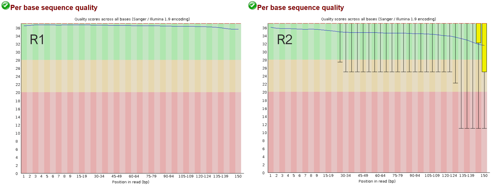

# Proyecto 1. Tabaquismo y expresión génica en carcinoma oral de células escamosas

**Entrega 2 - Pipeline funcional de RNA-seq**  

**Estudiante:** Javiera Canelo
**Fecha de entrega:** 29 de septiembre del 2026

## 1. Objetivo

Implementar y probar el workflow de procesamiento de RNA-seq definido en la Entrega 1, documentar su configuración, parámetros utilizados y resultados de ejecución.

## 2. Datos de prueba

Para armar y probar el funcionamiento del pipeline, se utilizó un subconjunto de los datos seleccionados para el proyecto:  
- run SRR16013054, corrsponiente a OSCC_4-P de GSE184616 e incluido en el samplesheet del estudio.

Se extrajeron los primeros 100.000 spots mediante SRA Toolkit obteniendo 100.000 pares de lecturas de 150 bases.  

## 3. Implementación y configuración

### 3.1. Organización del workflow

### 3.2. Ambiente y versiones 

### 3.3. Configuración de ejecución

## 4. Pruebas y resultados

### 4.1. Control de calidad inicial

Los FASTQ originales se evaluaron con FastQC. En general, ambas
lecturas presentaron una calidad elevada, aunque R2 mostró un
deterioro mayor hacia el extremo final.

En la posición 150, la calidad promedio (`Mean`) fue 35,59 en R1 y 31,55 en R2. El límite que contiene al 90% de las bsaes con mejor calidad (`10th Percentile`) fue Q37 en R1 y Q11 en R2, es decir, al final de R2, aproximadamente el 10% de las bases presentó una calidad igual o inferior a Q11, aunque el promedio global de esa posición fuera sobre Q30.

*Figura 1. Distribución de la calidad por posición de R1 y R2 (`Per base sequence quality`) antes del trimming.*

FastQC también mostró que una proporción importante de las lecturas contenía secuencias de adaptador al aproximarse al extremo final. En el tramo 138-139, la proporción acumulada de lecturas en que se había detectado el adaptador universal de Illumina (`Illumina Universal Adapter`) alcanzó un 41,2% en R1 y 40,53% en R2.

Este porcentaje no corresponde al porcentaje de bases que son adaptadores, sino quee a la proporción acumulada de lecturas en las que el adaptador fue detectado hasta esa posición. El resultado sugiere que una parte de los fragmentos secuenciados era más corta que las 150 bases leídas.

En ese mismo tramo, la señal acumulada de colas de guanina (`polyG`) alcanzó un 0,71% en R1 y 7,17% en R2. Su mayor presencia en R2 es compatible con un artefacto de lectura asociado a la tecnología de dos colores utilizada por NovaSeq.

)
*Figura 2. Detección acumulada de adaptadores y colas polyG por posición (`Adapter Content`) antes del trimming.*

A partir de estos resultados, se decidió probar el trimming de adaptadores y colas polyG. 

### 4.2. Trimming y parámetros

Con el fin de remover los adaptadores universales de Illumina, recortar (*trimming*) las colas de guanina (polyG) y eliminar las bases de baja calidad en los extremos 3', se aplicó un procesamiento de lecturas mediante **fastp**. Fastp procesó conjuntamente R1 y R2 y generó nuevos FASTQ con las lecturas filtradas.

Los parámetros utilizados fueron los siguientes:

| Parámetro | Uso |
|---|---|
| `--detect_adapter_for_pe` | Búsqueda adicional de adaptadores en datos paired-end |
| `--trim_poly_g` | Trimming de colas polyG |
| `--length_required 30` | Longitud mínima provisional de 30 bases para evitar conservar lecturas demasiado cortas después del trimming |
| `--thread 2` | Asignación de 2 hilos para la ejecución local del subconjunto de prueba |
| `--html` y `--json` | Generación de un reporte visual y un archivo estructurado con las métricas del procesamiento |

Adicionalmente, se mantuvieron los filtros predeterminados de fastp. 
Una base se consideró de calidad suficiente a partir de **Q15** (`qualified_quality_phred = 15`) y se permitió hata un 40% de bases inferiores a ese valor por lectura (`unqualified_percent_limit = 40`). Además se aceptaron como máximo 5 bases no determinadas (`n_base_limit = 5`).

### 4.3. Resultados del trimming

El resumen de fastp mostró una disminución de 200.000 a 185.538 lecturas, equivalentes a 100.000 y 92.769 pares, respectivamente. Es decir, se conservó el 92,77% de las pares y el 81,22% de las bases originales. 

Como consecuencia del trimming, se observó:

- un aumento en la proporción de bases de alta calidad, de 91,63% a 95,13% (`Q30 bases`);
- una disminución de la longitud promedio de 150 a 131 bases;
- mantención del %GC global, de 49,39 a 49,43%.

)
*Figura 3. Resumen de las lecturas antes y después del procesamiento (`Before filtering` y `After filtering`) reportador por fastp.*

De las lecturas que no se conservaron después del procesamiento, la principal causa de descarte fue la baja calidadd. fastp clasificó 14.072 lecturas como `low quality`, debido a que más del 40% de sus bases presentaba una calidad inferior a Q15.

Como los datos son paired-end, R1 y R2 se evaluaron como par, en donde si una de las 2 lecturas no superaba los filtros el par completo no se conservaba en las salidas pareadas. Las cifras del reporte contabilizan lecturas individuales en conjunto (R1 y R2).

Otros motivos de descarte tuvieron una baja frecuencia:
- 26 lecturas superaron el máximo permitido de bases no determinadas (`too many N`);
- 364 quedaron bajo el mínimo de 30 bases;
- ninguna fue clasificada como dímero de adaptador. 

)
*Figura 4. Distribución de las lecturas según el resultado del filtrado (`Filtering result`) reportado por fastp.*

### 4.4. Control de calidad posterior al trimming

Después del trimming, los módulos evaluados por FastQC fueron clasificados como `pass` tanto en R1 como en R2.

En R1, la calidad promedio aumentó de Q35 a Q36 y el valor bajo el cual se encontraba el 10% de las bases (`10th Percentile`) se mantuvo en Q37. En R2, la calidad del extremo final también mejoró. En la posición 150, la calidad promedio aumentó de Q31 a Q35 y el `10th Percentile` aumentó de Q11 a Q25.

<!-- FIGURA 5
Gráfico comparativo elaborado en R con los datos de FastQC.
Paneles para R1 y R2, mostrando Mean y 10th Percentile.
Antes: línea discontinua. Después: línea continua.

-->
*Figura 5. Comparación de la calidad promedio y del umbral que delimita el 10 % inferior de la distribución de calidad (`10th Percentile`) antes y después del trimming en R1 y R2.*

La presencia acumulada del adaptador universal de Illumina disminuyó de 41,2% a 0,003% en R1 y de 40,53% a 0% en R2. La señal `polyG` también disminuyó, de 0,71% a 0,002% en R1 y de 7,17% a 0,44% en R2.

<!-- FIGURA 6
Gráfico comparativo elaborado en R con los datos de FastQC.
Paneles para R1 y R2 y para cada señal.
Comparar Illumina Universal Adapter y PolyG.
Antes: línea discontinua. Después: línea continua.

-->
*Figura 6. Comparación de la detección acumulada del adaptador universal de Illumina y de secuencias polyG antes y después del trimming en R1 y R2.*

En conjunto, el trimming redujo prácticamente toda la señal del adaptador de Illumina, disminuyó las colas polyG y mejoró la calidad del extremo final de R2, conservando el 92,77% de los pares. Por lo tanto, la configuración probada se consideró adecuada para integrarla inicialmente al workflow y evaluarla posteriormente en otros runs de prueba del proyecto.

## 5. Ejecución integrada en Nextflow

### 5.1. Estructura del workflow

<!-- COMPLETAR CUANDO LOS PROCESOS ESTÉN CONECTADOSSSS
explicar el flujo ejecutado:
- control de calidad inicial (fastqc_raw)
- procesamiento de lecturas (fastp)
- control de calidad posterior (fastqc_trimmed)
- integracion de reportes (multiqc)
- extras¿¿
-->

<!-- FIGURA 7: 
Insertar el DAG generado por Nextflow.
Título sugerido: Procesos y dependencias del workflow ejecutado.
-->
*Figura 7. Procesos y dependencias del workflow ejecutado, representados mediante el grafo dirigido (`DAG`) de Nextflow.*

### 5.2. Configuración de la ejecución

<!-- COMPLETAR CON:
- SAMPLEsheet
- perfil
- ambiente oscc_rnaseq
- versiones de nf y extras
- recursos asignados a cada proceso
- parametros extras
-->

### 5.3. Ejecución sobre los datos de prueba

<!-- PEGAR COMANDO
explicar:
- qué archivo inicio el wf
- samplesheet
- mkdir
- reportes
-->

### 5.4. Resultados de la ejecución

<!-- COMPLETAR 
- procesos ejecutados
- cantidad de tareas
- estado final
- archivos integrados al repositorio
- -resume¿¿
-->

### 5.5. Trazabilidad y reportes de Nextflow

<!--documentación de la ejecución blablabla
COMPLETAR 
- report: uso de recursos y estado de procesos
- trace: una fila por tarea con tiempo, CPU y memoria
- timeline: orden y duracion de las tareas
- DAG: dependencias entre procesos

insertar enlaces relativos a los archivos en el repo...
-->

<!-- FIGURA 8: 
Captura del report o timeline de nf
-->
*Figura 8. Resumen de la ejecución obtenido desde los reportes de Nextflow.*
