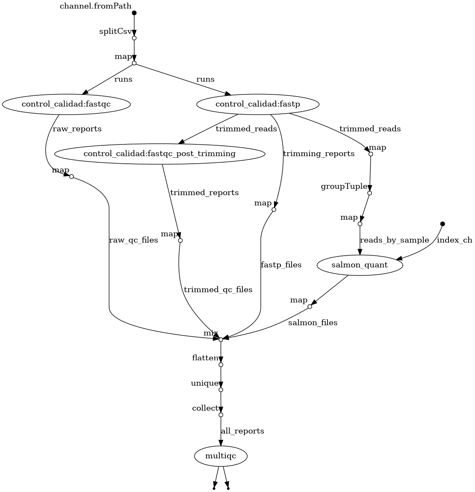

<style>
@media print {
    h1, h2, h3, h4 {
        break-after: avoid;
        page-break-after: avoid;
    }

    p {
        orphans: 3;
        widows: 3;
    }

    tr, img {
        break-inside: avoid;
    }
}

@page {
  @bottom-center {
    content: "Página " counter(page) " de " counter(pages);
    font-family: Arial, sans-serif;
    font-size: 9pt;
    color: #666;
  }
}
</style>

# Proyecto 1. Tabaquismo y expresión génica en carcinoma oral de células escamosas

**Entrega 2 - Pipeline funcional de RNA-seq**  

**Estudiante:** Javiera Canelo
**Fecha de entrega:** 29 de septiembre del 2026

## 1. Objetivo

Implementar y evaluar el workflow de procesamiento de RNA-seq definido en la Entrega 1, documentar su configuración, parámetros utilizados y resultados obtenidos con subconjuntos de prueba.

La evaluación comprende el control de calidad, el procesamiento de lecturas, la agrupación de runs por muestra, la cuantificación de transcritos y la integración de reportes. Su propósito es comprobar el funcionamiento técnico del pipeline antes del procesamiento de los datos completos y del análisis de expresión diferencial.

## 2. Datos de prueba

El proyecto contempla ocho muestras tumorales de GSE184616, correspondientes a 12 runs de secuenciación paired-end. Cuatro muestras presentan tabaquismo reportado como “yes” y cuatro como “no”.

El desarrollo y evaluación del pipeline se realizó en 2 etapas:

1. **Prueba piloto sobre OSCC_4-P**. Se utilizaron los primeros 100.000 spots del run SRR16013054, obtenidos mediante SRA Toolkit. Se generaron 100.000 pares de lecturas de 150 bases. Este subconjunto permitió desarrollar el pipeline y luego probar el preprocesamiento.

2. **Prueba integrada sobre 8 muestras**. Posteriormente, para comprobar la ejecución del workflow con todos los runs seleccionados y la agrupación de las muestras con múltiples runs, se utilizaron los primeros 100.000 spots de cada uno de los 12 runs seleccionados. La entrada total fue de 1.200.000 pares de lecturas, distribuidos en 24 archivos FASTQ.

OSCC_11-P y OSCC_13-P tienen tres runs cada una, por lo que aportaron 300.000 pares iniciales por muestra. Las otras seis muestras aportaron 100.000 pares cada una. Los runs de una misma muestra se agruparon para obtener una única cuantificación por muestra biológica.

La prueba piloto se identificó mediante `metadata/samplesheet_test.csv` y la prueba integrada mediante `metadata/samplesheet_test_all.csv`.

## 3. Implementación y configuración

### 3.1. Organización del workflow

El workflow se implementó en Nextflow DSL2 y se organiza en un flujo principal, un subworkflow de control de calidad y módulos por herramienta.

```text
workflow/
├── main.nf                     # lectura del samplesheet e integración de las etapas
├── subworkflows/
│   └── control_calidad.nf      # conexión fastqc + fastp + fastqc_post_trimming
└── modules/
    ├── qc.nf                   # fastqc (lecturas originales)
    ├── trimming.nf             # fastp
    ├── qc_post.nf              # fastqc (lecturas recortadas)
    ├── salmon.nf               # cuantificación
    └── multiqc.nf              # reporte integrado
```

El flujo `main.nf` lee el samplesheet (`sample,run,fastq_1,fastq_2`). FastQC inicial y fastp reciben las lecturas originales por run y pueden ejecutarse en paralelo. FastQC posterior recibe las salidas de fastp. Las lecturas procesadas se agrupan por muestra, conservando la asociación de R1 y R2 de cada run, y se entregan a Salmon.

Finalmente, MultiQC integra los reportes de FastQC, fastp y Salmon.



*Figura 1. Grafo de procesos y dependencias del workflow integrado. El preprocesamiento se realiza por run y la cuantificación por muestra biológica.*



### 3.2. Ambiente y versiones 

La ejecución se realizó en el ambiente `oscc_rnaseq`, gestionado mediante micromamba y exportado en `environment.yml`. Las versiones registradas en `reportes/versiones.txt` fueron:

| Herramienta | Versión | Uso |
|---|---|---|
| Nextflow | 26.04.6 | Orquestación del workflow |
| FastQC | 0.12.1 | Control de calidad |
| fastp | 1.3.7 | Trimming de adaptadores y polyG |
| Salmon | 2.7.0 | Cuantificación de transcritos |
| MultiQC | 1.35 | Integración de reportes |

Se utilizó el perfil `local`, que ejecuta los procesos con las herramientas disponibles en el ambiente activo, sin contenedores.

### 3.3. Parámetros de preprocesamiento

fastp procesó conjuntamente R1 y R2, generando FASTQ pareados y reportes HTML y JSON. Se incorporó el recorte de adaptadores y polyG a partir de las señales observadas en la prueba piloto de OSCC_4-P.

| Parámetro | Función |
|---|---|
| `--detect_adapter_for_pe` | Habilita la detección adicional de adaptadores paired-end, cuya presencia se observó en la prueba piloto |
| `--trim_poly_g` | Recorta colas polyG, detectadas especialmente en R2 del subconjunto piloto. |
| `--length_required 30` | Descarta lecturas menores de 30 bases después del recorte. Se utilizó como umbral inicial para excluir lecturas muy cortas; no se compararon otros valores. |
| `--thread 2` | Asigna 2 hilos para la ejecución local. |
| `--html` y `--json` | Genera reportes |

Adicionalmente, se conservaron los filtros predeterminados de fastp. 
Una base se consideró de calidad suficiente a partir de **Q15** (`qualified_quality_phred = 15`) y se permitió hasta un 40% de bases inferiores a ese valor por lectura (`unqualified_percent_limit = 40`). Además se aceptaron como máximo 5 bases no determinadas (`n_base_limit = 5`). Estos valores se utilizaron como configuración inicial, sin optimización específica para el conjunto completo de datos.

El comando no activó recorte de extremos mediante ventanas de calidad. Además, el umbral de longitud de 30 bases es inferior al tamaño de k-mer del índice de Salmon, de 31; por ello, conservar una lectura no garantiza que aporte evidencia útil a la cuantificación.

### 3.4. Referencia y cuantificación

La ejecución utilizó el índice local `reference/salmon_gencode_v50`, asociado al transcriptoma GENCODE v50. Se mantuvo la misma referencia para todas las muestras. El archivo de información del índice registra un tamaño de k-mer de 31 y ausencia de secuencias decoy; no se compararon configuraciones alternativas de indexación.

| Parámetro | Función |
|---|---|
| `--libType A` | Permite inferir el tipo de biblioteca a partir de las lecturas y revisar su consistencia entre muestras. En la prueba se detectó `ISR` en las 8 muestras. |
| `--validateMappings` | Se incluyó para utilizar validación de los mapeos durante la cuantificación. |
| `--seqBias` | Se activó para considerar sesgos de secuencia en la estimación de abundancia. |
| `--gcBias` | Se activó para considerar sesgos asociados al contenido GC. |
| `--threads 2` | Asigna 2 hilos para la ejecución local. |

No se realizaron comparaciones con y sin las correcciones de sesgo, por lo que no se atribuye una mejora cuantificada a cada opción individual.

Para las muestras con múltiples runs, se entregaron conjuntamente las listas de archivos R1 y R2 correspondientes, manteniendo el mismo orden entre ambas. De esta manera se obtuvo una cuantificación por muestra biológica, sin tratar los runs como réplicas independientes.



### 3.5. Recursos

| Proceso | CPUs por tarea | Configuración adicional |
|---|---:|---|
| FastQC inicial | 2 | Una tarea por run |
| fastp | 2 | Una tarea por run |
| FastQC posterior | 2 | Una tarea por run |
| Salmon | 2 | `maxForks 1`: una muestra a la vez |
| MultiQC | 1 | Un reporte integrado |

Salmon se limitó a una tarea simultánea para controlar el uso de memoria RAM local. En la ejecución registrada, cada tarea alcanzó aproximadamente 3,2-3,5 GB de RAM.

## 4. Prueba piloto del preprocesamiento

La primera prueba se realizó con OSCC_4-P para comprobar la ejecución de FastQC, fastp y FastQC posterior, así como la generación de sus archivos de salida.

| Métrica del subconjunto | Antes | Después |
|---|---:|---:|
| Pares de lecturas | 100.000 | 92.769 |
| Proporción de bases Q30 | 91,63 % | 95,13 % |
| Longitud media reportada para R1 y R2 | 150 bases | 131 bases |

Se conservó el 92,77% de los pares. FastQC posterior mostró una disminución de la señal de adaptadores, aunque persistieron advertencias y fallos en otros módulos.

La prueba permitió comprobar el funcionamiento del preprocesamiento y observar su efecto sobre el subconjunto. Los parámetros se utilizaron posteriormente en la prueba integrada de los 12 runs. Estos resultados no constituyen una evaluación de la calidad de la biblioteca completa.



## 5. Prueba integrada del pipeline

### 5.1. Ejecución y registro de entradas

La prueba integrada utilizó `metadata/samplesheet_test_all.csv`, con los 12 runs de las 8 muestras seleccionadas.

El comando registrado para iniciar la ejecución fue:

`bash scripts/ejecutar_pipeline.sh metadata/samplesheet_test_all.csv`

El lanzador comprueba la disponibilidad de las herramientas, que el samplesheet exista y no esté vacío, y la presencia del archivo de información del índice de Salmon. Crea una carpeta de resultados, guarda una copia del samplesheet y las versiones utilizadas, y solicita los reportes de ejecución, tiempo y tareas de Nextflow.

La ejecución documentada se encuentra en `results/pipeline/20260928_121044/`.

### 5.2. Estado, duración y recursos

La ejecución finalizó con **45 tareas completadas**, sin tareas fallidas ni reintentos, en **22 min 48 s**. El reporte de Nextflow registró **0,9 horas de CPU**.

| Proceso | Tareas | Duración por tarea | RAM máx. por tarea |
|---|---:|---|---|
| fastqc | 12 | 9,2–11,6 s | 342–528 MB |
| fastp | 12 | 9,3–12,7 s | 1,2 GB |
| fastqc_post_trimming | 12 | 8,7–12,3 s | 384–505 MB |
| salmon_quant | 8 | 1 min 42 s–4 min 55 s | 3,2–3,5 GB |
| multiqc | 1 | 10,3 s | 238 MB |

El preprocesamiento se desarrolló en aproximadamente 1 minuto. Salmon concentró la mayor parte del tiempo, con las muestras procesadas secuencialmente. Las muestras de un run requirieron alrededor de 2 minutos y las de tres entre 4-5 minutos.



### 5.3. Verificación de las salidas

La revisión de los archivos permitió comprobar las salidas esperadas de cada etapa:

| Etapa | Salidas comprobadas |
|---|---|
| FastQC inicial | 24 reportes HTML y 24 ZIP |
| fastp | 24 FASTQ procesados, 12 reportes HTML y 12 JSON |
| FastQC post-trimming | 24 reportes HTML y 24 ZIP |
| Salmon | 8 archivos `quant.sf`, acompañados de métricas y logs |
| MultiQC | Un reporte HTML integrado y su carpeta de datos |

Las 45 tareas se distribuyeron en 12 ejecuciones de FastQC inicial, 12 de fastp, 12 de FastQC posterior, 8 de Salmon y 1 de MultiQC.

En conjunto, fastp conservó **1.101.060 de los 1.200.000 pares iniciales**, equivalentes al **91,76%**. Los pares procesados se entregaron a la etapa de cuantificación.

### 5.4. Agrupación de runs y cuantificación por muestra

Para comprobar la conexión entre preprocesamiento y cuantificación, se comparó la suma de pares conservados por fastp con el número de fragmentos procesados por Salmon para cada muestra.

Ambos conteos coincidieron en las 8 muestras:

| Muestra | Runs | Pares conservados por fastp | Fragmentos procesados por Salmon | Mapeo (%) |
|---|---:|---:|---:|---:|
| OSCC_4-P | 1 | 92.769 | 92.769 | 73,23 |
| OSCC_5-P | 1 | 93.441 | 93.441 | 89,87 |
| OSCC_13-P | 3 | 277.384 | 277.384 | 84,69 |
| OSCC_16-P | 1 | 86.579 | 86.579 | 87,75 |
| OSCC_1-P | 1 | 92.124 | 92.124 | 83,66 |
| OSCC_2-P | 1 | 94.334 | 94.334 | 79,90 |
| OSCC_10-P | 1 | 91.099 | 91.099 | 89,37 |
| OSCC_11-P | 3 | 273.330 | 273.330 | 85,73 |

Además de los conteos, se revisaron las listas de entrada registradas por Salmon. OSCC_11-P y OSCC_13-P recibieron sus 3 runs con correspondencia entre R1 y R2, y cada muestra produjo una única cuantificación.

Las tasas de mapeo se incluyen como métricas de salida de la prueba. Sus diferencias no se interpretan como diferencias biológicas entre muestras o grupos, ni como una evaluación definitiva de las bibliotecas completas.

### 5.5. Integración de reportes

MultiQC incorporó:

- 48 reportes FastQC: 24 previos y 24 posteriores al procesamiento.
- 12 reportes fastp: uno por run.
- 8 resultados Salmon: uno por muestra.

Esto permitió comprobar que los reportes de las distintas etapas llegaron al módulo de integración y quedaron disponibles para su revisión conjunta.

### 5.6. Tamaño de los archivos

Los tamaños corresponden a los archivos locales de la prueba y se expresan en MiB.

| Elemento | Tamaño |
|---|---:|
| FASTQ de entrada: 24 archivos | 156,65 MiB |
| Transcriptoma v50 comprimido | 175,05 MiB |
| Índice de Salmon | 1.976,64 MiB |
| Salida de fastp | 148,49 MiB |
| FastQC inicial | 22,56 MiB |
| FastQC posterior | 22,22 MiB |
| Salmon: ocho muestras | 251,58 MiB |
| MultiQC | 20,50 MiB |
| **Total de resultados, incluidos reportes y resúmenes** | **467,22 MiB** |

Estos valores describen el almacenamiento de la prueba. No permiten estimar directamente el espacio total que requerirá el procesamiento de las bibliotecas completas.



### 5.7. Trazabilidad y evidencia de ejecución

La ejecución documentada corresponde a `results/pipeline/20260928_121044/`. Se incluye una copia de sus reportes y archivos de identificación en `docs/evidencia_entrega_2/20260928_121044/`.

Las rutas de la siguiente tabla son relativas a esa carpeta de evidencia:

| Archivo o carpeta | Contenido |
|---|---|
| `reportes/samplesheet.csv` | Copia de las entradas utilizadas |
| `reportes/versiones.txt` | Versiones de las herramientas |
| `reportes/report.html` | Estado general y uso de recursos | 
| `reportes/trace.tsv` | Estado, duración y recursos por tarea |
| `reportes/timeline.html` | Distribución temporal de las tareas |
| `multiqc/multiqc_report.html` | Reporte integrado de las herramientas |
| `multiqc/multiqc_report_data/` | Datos y registros de MultiQC |
| `resumen_entrega2/` | Tablas de resumen de runs, muestras y tareas |

La revisión de `report.html` y `trace.tsv` confirmó las 45 tareas completadas sin errores. El timeline permitió examinar el orden y la duración de los procesos, y el MultiQC permitió revisar conjuntamente las salidas a de las herramientas.

Los FASTQ y los archivos intermedios no forman parte de esta copia de evidencia.

## 6. Alcance y limitaciones

La evaluación comprobó la ejecución del workflow y la generación de sus salidas sobre subconjuntos pequeños. No evaluó su comportamiento con el volumen completo de datos.

La extracción de los primeros 100.000 spots de cada run no constituye un muestreo aleatorio. Además, las muestras con 3 runs aportaron más pares que las muestras con un solo run. Por ello, las métricas de calidad y mapeo se utilizan como evidencia técnica de la prueba y no para comparar las muestras biológicamente.

La finalización de las tareas sin errores tampoco implica que todos los módulos de FastQC deban estar clasificados como `PASS`. Las advertencias persistentes deberán interpretarse al revisar las bibliotecas completas.

En esta entrega no se realizó análisis de expresión diferencial ni enriquecimiento funcional.

## 7. Conclusión

El pipeline se evaluó primero mediante una prueba piloto sobre OSCC_4-P y posteriormente mediante una ejecución integrada de los 12 runs correspondientes a las 8 muestras seleccionadas.

La ejecución integrada completó las 45 tareas previstas y generó los reportes de preprocesamiento, 8 cuantificaciones y 1 reporte MultiQC. Se comprobó la agrupación de los runs por muestra y la coincidencia entre los pares conservados por fastp y los fragmentos recibidos por Salmon.

Estos resultados demuestran el funcionamiento técnico del workflow para los datos de prueba. El procesamiento de las bibliotecas completas y el análisis de expresión génica constituyen las siguientes etapas del proyecto.
