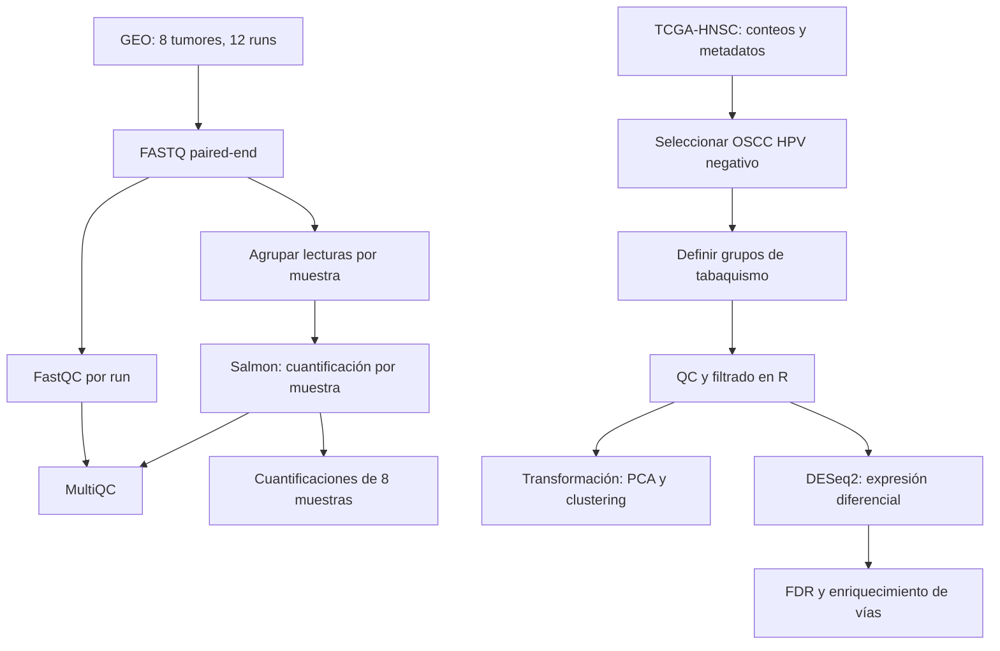

# Diagrama del proyecto

## Implementación prevista

- El procesamiento de FASTQ se implementará en Nextflow DSL2.
- Se evaluará trimming según los resultados de calidad.
- Los runs de una misma muestra se agruparán para cuantificarla.
- Se usarán ambientes reproducibles y versiones documentadas.
- Nextflow generará report, timeline, trace y DAG.
- El análisis principal utilizará los datos preprocesados de TCGA.
- La comparación con conteos publicados de GEO será opcional
  y se realizará mediante análisis separados.