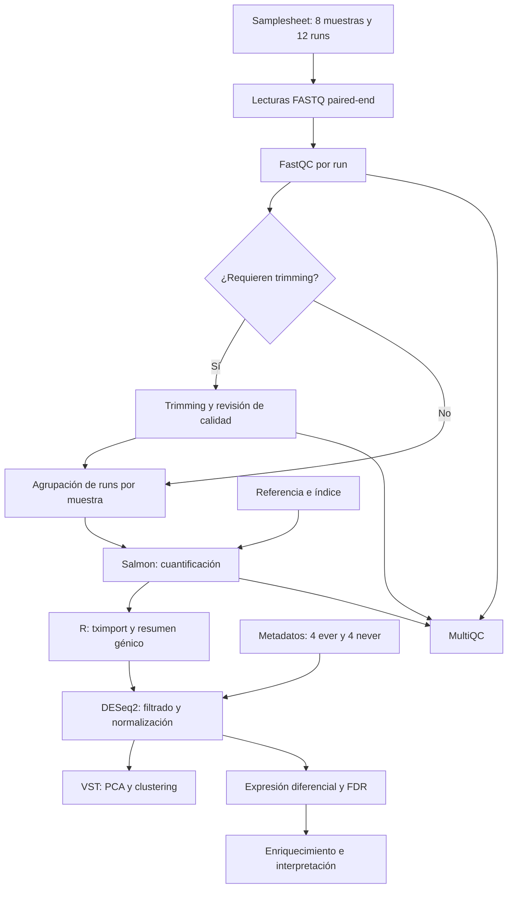

# Workflow del proyecto

Workflow propio en Nextflow DSL2 para ocho muestras tumorales
de GSE184616 y análisis posterior en R.

## Decisiones de diseño

- La necesidad de trimming se decidirá mediante revisión de calidad.
- Los runs se agruparán manteniendo R1 y R2 asociados.
- MultiQC integrará los reportes de las herramientas.
- tximport permitirá pasar de cuantificaciones de transcritos
  a información a nivel de gen para el análisis.
- Nextflow generará report, timeline, trace y DAG.
- nf-core/rnaseq se utiliza como referencia de diseño, no como
  pipeline ejecutado en este proyecto.