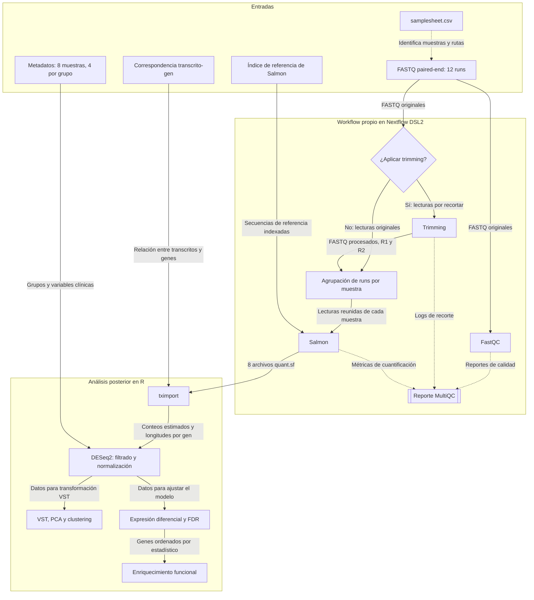

# Workflow del proyecto

Workflow en Nextflow para ocho muestras tumorales
de GSE184616 y análisis posterior en R.

## Decisiones de diseño

- La necesidad de trimming se decidirá mediante revisión de calidad
  y se configurará explícitamente; FastQC no toma esa decisión.
- Los runs se agruparán manteniendo R1 y R2 correctamente asociados.
- Cada muestra biológica producirá una cuantificación.
- Si se aplica trimming, se revisará también la calidad de las lecturas procesadas.
- MultiQC integrará los reportes de las herramientas.
- tximport permitirá pasar de cuantificaciones de transcritos
  a información a nivel de gen para el análisis.
- Nextflow generará report, timeline, trace y DAG.
